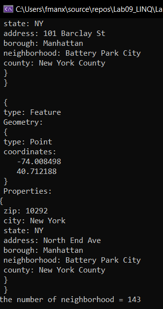
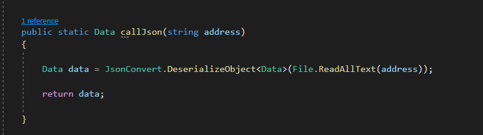
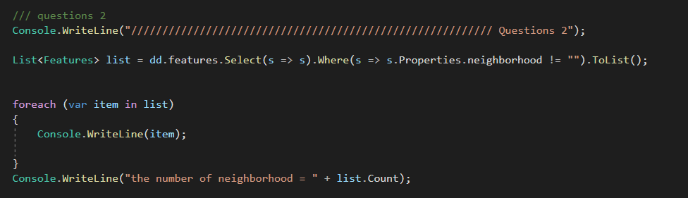

# LINQ :floppy_disk: :mag: 
this project deal with data json as a file and do some query statement.

## summary :clipboard:
1. in this project we use `NuGet` packages and install NewtonSoft.Json that library is a easy way to deal with json and convert it in our project.
2. we create a json file with the name `data` contain data for some locations in Manhattan.
3. we convert the data from json to object using `JsonConvert.DeserializeObject` which makes dealing with data more easy.
4. we do some `LINQ` and original `Query` statements on the data.

## Visuals  :bookmark_tabs:

  

## Happy Path :bulb:

1. after cloning the project add your location's data (json file).

2. send the path for the data file to method `callJson` to deal with it as objects.

   

3. use the `LINQ` statement to get the data or write your query statement.

